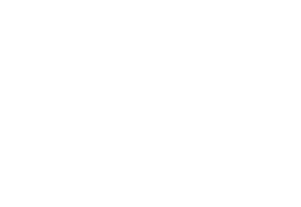

# But

Le joueur devra gérer des infrastructures afin de protéger des humains d'intempéries environnementales.

# Description

La première phase d'un tour sera celle où le joueur devra construire ou réparer sa base. Son objectif primaire sera de protéger ses humains et il pourra aussi, à sa guise, protéger ses machines et autres infrastructures. Il disposera d'un certain nombre de SIMCoins qu'il devra utiliser pour acheter les pièces ou les appareils dont il à besoin. Le joueur devra gérer l'énergie dont il dispose. Lorsque celui-ci utilisera des appareils, ceux-ci consommeront de l'énergie et il devra allouer un certain nombre d'énergies pour les appareils,  ce qui affectera leur efficacité.

La deuxième phase est celle où une catastrophe se produit. Cette phase comportera certains types d'intempéries qui endommageront les structures du joueur et infligera des blessures aux humains.

# Objets

Le joueur aura à sa disposition plusieurs objets composés de matériaux différents, de diverses formes, avec différentes caractéristiques et liables à d’autres objets.

Ces objets prennent un certain temps à construire et à réparer selon le nombre d’humains restants. Ces objets seront endommagés ou détruits par des intempéries et diverses catastrophes naturelles.

Afin de se procurer des objets, il existe deux types de ressources : l’énergie et les SIMCoins. L’énergie est gagnée selon le nombre de sources d’énergie connectées tandis que les SIMCoins sont gagnés à la fin d’un tour selon le nombre de structures de minage et l’énergie disponible.

Les objets connus sont séparés en deux catégories : les structures et les machines.

## Machines

Les machines sont des objets utilisant les monnaies, connectés avec les fils.

Machines | Description
------------ | -------------
Éolienne | Génère de l'énergie avec la force du vent.
Panneau solaire | Génère de l'énergie avec la lumière du Soleil.
Pile | Emmagasine l'énergie qui n'est pas utilisée à chaque tour.
Fil conducteur | Transporte le courant généré aux appareils/piles. Le joueur aura deux choix: le type de matériel et son diamètre qui affecterons sa résistance.
Interrupteur | Couper le courant. S'installe en serie avec des fils conducteurs.
Régulateur de température | Modifie la température. Le joueur pourra choisir une augmentation ou diminution de la température ambiante. Le choix affectera la consommation d'énergie du régulateur.
SIMCoins Miner | Génère un certain nombre de nombres aléatoires à chaque tour qui sera déterminé par le joueur et qui affectera sa consommation d'énergie. S'il trouve le bon nombre, un SIMCoin sera ajouté au total du joueur et un nouveau nombre sera généré. Plus le joueur choisit de nombres, plus cela consommera de l'énergie. En revanche, s'il est chanceux et trouve les bons nombres rapidement, il trouvera beaucoup de SIMCoins.
Champ de force | Diminue la vitesse des projectiles entrant, selon un certain volume qui sera déterminé par le joueur et qui affectera sa consomation d'énergie.

## Structures

Les structures, disponibles en plusieurs matériaux sont utilisées pour construire l'abri.

Structure | Description | Construction 
------------ | ------------- | ------------- 
Cube | Sert de fondation | Le joueur choisit la largeur et longueur et place la fondation. 
Mur | Va sur la fondation, protège des intempéries | Le joueur sélectionne la fondation, la longueur du mur et la hauteur. Il peut ne pas sélectionner de fondation mais les murs seront plus vulnérables. 
Toit | Va sur les murs | Disponibles en plusieurs types (plat, hexagonal, pyramidal), le joueur choisit la longueur, le type et la grosseur. Détruit lorsqu'il n'est soutenu que par deux ou moins murs. 
Planché | Permet de faire des étages et certains types de toits | Le joueur choisit les murs ainsi que la largeur et la longueur.

### Matériaux

Materiaux | Resistance | Masse | Points de rupture | Prix
------------ | ------------- | ------------ | ------------- | ------------
Carton | 5 | 2 | 5 | 1
Bois | 4 | 3 | 4 | 2
Pierre | 3 | 4 | 3 | 3
Métal | 2 | 5 | 2 | 4
SIMtium | 1 | 1 | 1 | 5
Cuivre* | 5 | ∅ | ∅ | 1
Argent* | 1 | ∅ | ∅ | 5
 
La résistance du matériau change la quantité de Newton nécessaire pour l'endommager. La masse affecte le poids d'une structure dans une gravité quelconque. Le point de rupture est la capacité qu'à un matériau à soutenir un autre. Par exemple, un abri fait d'une fondation en carton et de murs en métal sera incapable de se soutenir car la masse du métal est beaucoup supérieure à celle du carton et le point de rupture du carton est très faible. Le prix est le montant de ressources nécessaires afin de construire une structure en un certain matériau. 

*Le cuivre et l'argent sont spéciaux, car ils ne sont applicables que pour les fils conducteurs. Non seulement le joueur choisira parmi deux matériaux et il choisira aussi la grosseurs du fil (en millimètres, qu'il choisira lui-même), ce qui affectera sa résistance.

# Construction

Pour la construction de structure, le joueur disposera de plusieurs outils. Le premier étant un outil lui permettant de créer des fondations au sol. Les fondations permettent de créer une base solide pour les murs. Le joueur pourra placer des carrés au sol et ceux-ci représenteront la première ébauche de la base. Ensuite, le joueur pourra construire automatiquement des murs à partir d'une fondation qu'il aura créée au préalable. Le joueur aura le choix de plusieurs matériaux (voir tableau des matériaux) et il pourra aussi choisir la hauteur des murs. Le choix des matériaux et la hauteur des murs affecteront le prix. Pour terminer sa base, le joueur devra y installer un toit. Plusieurs formes de toits seront disponibles; Un toit simple (ou planché), un toit avec un seul pan, un toit avec deux pans et un toit avec quatre pans. Le joueur devra entrer les dimensions du toit (longueur, largeur, hauteur), et choisir un matériau. À partir de ces données, un toit sera généré automatiquement et le joueur pourra le placer sur les murs. Le prix d'un toit sera déterminé par le type de matériaux utilisés et par son aire totale. Chaque coté de toit et chaque mur disposera d'un point d'ancrage. Un toit doit être obligatoirement connecté à au moins deux point d'ancrage, sinon celui-ci s'écroule.

# Énergie

Les sources d'énergie (éolienne, panneau solaire, etc.) fournissent du courants aux machines consommant de l'énergie si celles-ci y sont connectées. Les sources et les machines se connectent entre-elles avec des fils conducteurs. Dépendement de la résistance des fils, ceux-ci dissipent l'énergie. Si un circuit est trop long, l'énergie pourrait manquer au bout du circuit. Chaque circuit est indépendant les uns des autres.

Schéma d'un circuit lors d'un tour complet

# Intempéries

Intempéries | Description
------------ | -------------
Pluie/Acide | Les pluies ou les pluies acides auront pour effet de réduire la résistance des matériaux.
Neige/Acide | La neige produira une accumulation sur les toits et cette accumulation produira une force sur le toit. Étant donné que les toits auront un point de rupture, si la force est trop grande, le toit s'écroulera. Si la température se réchauffe, la neige fond et elle aura le même effet que la pluie sur les toits où elle se serait accumulée.
Grèle/Météorites | Projectiles qui endommage les structures/objets. Les météorites peuvent faire prendre des objets en feu.
Vent/Tornade | Le vent applique une force sur les structures. Les tornades agissent comme du vent avec des projectiles.
Feu | Le feu s'appliquerait à une certaine pièce de structure ou à une machine, il se propagerait et il ferait plus ou moins de dommages dépendamment du matériel. Il serait déclanché par d'autres intempéries.
Température | Elle affecterait le fonctionnement de certains appareils et la résistance de certains matériaux. La température infligerait aussi des dommages aux humains ne se trouvant pas dans une zone tempérée.
Éclair | Fait prendre l'objet touché en feu. Si un humain est touché, il subit des dommages.
Tremblement de terre | Réduit le point de rupture des matériaux.
Radiation | Inflige des dégâts par tour aux humains se trouvant dans la zone de radiation.

# Exemple

Une partie typique se déroulerait comme suit :

*Le joueur commence la partie en phase construction dans un monde avec dix humains qu'il doit protéger, une pile chargée avec 100 énergie, 100 SIMCoins et un SIMCoins Miner.*

*Le joueur décide d'acheter des cubes en carton afin de faire une fondation de format 5 x 5 au coût de 48 SIMCoins. Ensuite, il y connecte des murs en carton de deux "cubes" de hauteur (on parle ici des cubes dont est fait l'environnement 3D du jeu) au coût de 32 SIMCoins. Il relie ensuite sa pile à son SIMCoins Miner avec du fil de cuivre de 2mm de diamètre et de 3m de longueur au coût de 3 SIMCoins et fait fonctionner ce dernier à pleine capacité, ce qui consomme 75 d'énergie par tour et le fil en consomme 2. Il décide de prendre une chance et de ne pas construire de toit et termine son tour avec 17 SIMCoins*

*Lorsque la phase de construction est terminée, la première péripétie se produit. C'est un vent léger qui endommage légèrement les murs en carton sans les détruire. Au total, il lui reste 23 d'énergie à la fin de la phase de survie.*

*À la fin de la vague le joueur se voit allouer 146 SIMCoins par son SIMCoins Miner.*

*Au deuxième tour le joueur répare les murs en carton avec ses humains. Il décide d'acheter une éolienne au coût de 150 SIMCoins. Il la connecte à sa pile et au SIMCoins avec un fil de cuivre de 2mm de diamètre et de 4m de longueur au coût de 4 SIMCoins et à la consommation de 3 d'énergie. Il met en marche son éolienne et encore une fois son SIMCoins Miner à pleine capacité à 75 d'énergie et termine son tour avec 9 SIMCoins restant.*

*La deuxième péripétie est un vent très léger avec une légère pluie. Le vent et la pluie endommagent légèrement le carton, le SIMCoins Miner et la pile mais le vent a permis à l'héolienne de générer de l'énergie. Par contre, les humains ont perdu de la vie à cause de la pluie puisqu'il n'y avait pas de toit. Le SIMCoins miner a consommé toute l'énergie dans la pile (soit 23 d'énergie) mais a réussi à fonctionner à pleine capacité durant tout le tour grâce à l'éolienne.*

*À la fin de la vague le joueur se voit alloué 146 SIMCoins par son SIMcoins Miner et l'énergie générée par l'éolienne restante à remplie la pile à 50 d'énergie.*

*Au troisième tour le joueur répare les murs en carton et ses machines avec ses humains. De plus, il ajoute un toit en bois à quatre plans de format 5 x 5 x 3 au coût de 100 SIMCoins et le place sur sa base. Il ajuste le SIMCoins Miner pour qu'il n'utilise qu'une quantité moyenne d'énergie (soit 50 d'énergie) et désactive l'éolienne pour ne pas risquer de l'endommager. Il termine son tour avec 55 SIMCoins.*

*La troisième intempérie est un tremblement de terre qui détruit les murs en carton, ce qui cause la chute du toit. Ce dernier tombe sur les humains et les tue.*

*Puisque tous les humains sont morts la partie est terminée et le score final est compatibilisé.*
